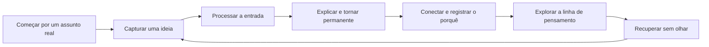
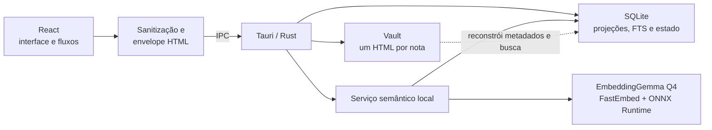

# Hyperzettel

Aplicativo desktop local-first para transformar capturas em ideias próprias, conectá-las com contexto e revisá-las por recuperação ativa.

O Hyperzettel reúne escrita, processamento Zettelkasten, mapa de conhecimento e revisão espaçada sem exigir conta, servidor ou chave de API. Cada nota é um arquivo HTML autocontido que continua legível fora do aplicativo.

> Estado atual: versão `0.8.0`, distribuída para Windows x64. O instalador ainda não possui assinatura de código e o Windows pode exibir um aviso do SmartScreen.

## O produto hoje

O problema que o Hyperzettel resolve não é apenas guardar notas. É impedir que capturas virem um arquivo morto: cada ideia pode ser esclarecida, separada, conectada com um motivo e revisitada quando a memória começa a enfraquecer.

O ciclo principal é:



### O que já está implementado

- onboarding que cria um mapa sobre um assunto real e conduz o primeiro ciclo;
- editor rico com autosave, conclusão explícita e onze modelos de nota;
- fila de processamento com seis decisões do método Zettelkasten;
- conexões manuais com motivo, backlinks e sugestões semânticas locais;
- mapa interativo com retenção por nota e por conexão;
- recuperação ativa e revisão espaçada com SM-2;
- busca textual local com SQLite FTS5;
- um HTML portátil e autocontido por nota, inclusive com imagens e conexões legíveis;
- Central do Vault para inspeção, recuperação e adoção de arquivos externos;
- backup JSON verificado para o estado que não cabe nos HTMLs.

## Fluxos de uso

### 1. Primeiro uso: produzir antes de configurar

Num vault vazio, a tela inicial pergunta qual assunto a pessoa quer compreender, decidir ou explicar. A partir da resposta, o app cria uma nota de estrutura — um mapa de conteúdo, ou MOC — com objetivo, perguntas-guia e próximo passo.

O guia acompanha o estado real das notas e propõe:

1. capturar uma ideia pequena que responda a uma das perguntas;
2. escrevê-la com palavras próprias;
3. processá-la até virar permanente;
4. conectá-la ao mapa e explicar a relação;
5. repetir até formar três ideias permanentes conectadas.

Não existe um tutorial paralelo nem conteúdo de demonstração. O primeiro ciclo já produz o início do vault da pessoa. Quem preferir pode ignorar o guia e começar com uma nota em branco.

### 2. Capturar e escrever

Uma nota nova nasce na **Entrada**, no estágio **Fugaz**. O editor aceita título multilinha, parágrafos, seis níveis de título, listas, citações, links, tabelas, linha divisória, alinhamento, destaque, imagens e blocos de código.

Imagens raster são otimizadas para WebP e embutidas no próprio HTML. Blocos de código preservam as quebras de linha e podem receber coloração local para 17 linguagens, além da opção sem coloração.

Há duas ações de persistência diferentes:

- **autosave:** após 700 ms sem alterações, protege conteúdo significativo no vault como rascunho;
- **Concluir nota** ou `Ctrl+S`: declara que a nota está pronta e a torna elegível para revisão.

Um modelo que ainda contém apenas as instruções iniciais pode ser protegido pelo autosave, mas não pode ser concluído como se já fosse conteúdo autoral.

### 3. Processar a Entrada

A fila inclui notas na pasta Entrada e notas que ainda estão no estágio Fugaz. Ela segue da captura mais antiga para a mais recente, mantém a mesma nota durante todo o fluxo e permite pular um item sem entrar em loop.

| Passo | Pergunta | Efeito possível |
| --- | --- | --- |
| 1. Triagem | Vale a pena processar? | Continuar, guardar como Referência em Recursos, enviar à Incubadora ou excluir. |
| 2. Origem | De onde veio? | Marcar como nota de Fonte ou como ideia própria. |
| 3. Explicação | Consegue explicar com suas palavras? | Continuar ou deixar a captura para pesquisar e reler depois. |
| 4. Atomicidade | Existe mais de uma ideia aqui? | Manter uma ideia só ou extrair seções H2 como notas permanentes ligadas à origem. |
| 5. Conexão | Onde essa ideia se conecta? | Escolher outras notas e registrar o motivo de cada relação. |
| 6. Estrutura | Faz parte de uma linha maior? | Transformar a nota em Estrutura/MOC ou concluí-la como Permanente em Recursos. |

Durante o processamento, a nota permanece visível ao lado das perguntas e pode ser aberta no editor. A sessão termina com um resumo da quantidade processada.

### 4. Conectar ideias

Uma conexão manual não guarda apenas o destino: ela também aceita a resposta para “por que estas notas se conectam?”. A relação aparece nas duas notas; cada ponta pode registrar seu próprio motivo. Ao escrever um motivo numa relação que só chegava como backlink, o app cria a declaração na volta.

O painel de propriedades reúne:

- conexões existentes, direção e motivos;
- seletor pesquisável para criar ou remover conexões;
- sugestões semânticas produzidas localmente;
- ação para conectar uma sugestão e escrever o motivo humano;
- opção de ocultar uma sugestão, com possibilidade de desfazer.

As sugestões automáticas não viram conexões por conta própria. O EmbeddingGemma Q4 calcula similaridade no dispositivo, mantém até cinco sugestões por nota e usa atualmente o limiar mínimo de `0,68`. A análise pode ser pausada, retomada ou reiniciada pela ação de tentar novamente após um erro.

### 5. Explorar o mapa

O mapa ocupa a área principal e mantém um painel lateral com três abas:

| Aba | O que permite fazer |
| --- | --- |
| **Explorar** | Filtrar por pasta e força, selecionar uma nota pelo grafo ou por uma lista acessível, ver conexões, retenção e abrir a nota. |
| **Curva** | Acompanhar a retenção média estimada nos últimos 30 ou 90 dias, ou em todo o histórico. |
| **Revisões** | Percorrer uma sessão finita de notas vencidas, ordenadas por prioridade. |

Notas fugazes e rascunhos continuam visíveis no grafo, mas somente notas concluídas e não fugazes entram nas métricas e revisões.

### 6. Recuperar sem olhar

Cada nota revisável pode definir uma **pergunta de recuperação** no painel de propriedades. Se ela estiver vazia, o título vira a pista.

O conteúdo permanece escondido até a pessoa tentar reconstruir a ideia e escolher **Revelar nota**. Só então aparecem quatro avaliações:

- Não lembrei;
- Com esforço;
- Lembrei bem;
- Imediato.

O app mostra o próximo intervalo associado à resposta e usa SM-2 para reagendar a nota. Revisar uma ideia também reforça as conexões ligadas a ela. A fila automática contém no máximo 25 notas por sessão e não cresce enquanto está sendo percorrida; também é possível abrir uma revisão avulsa diretamente no editor, mesmo antes do vencimento.

### 7. Trabalho recorrente

Depois do primeiro ciclo, a tela inicial escolhe uma única prioridade com base no estado do vault:

1. etapa incompleta do primeiro ciclo;
2. revisões vencidas;
3. capturas na Entrada;
4. escrita livre quando não há pendências.

Ela também mostra total de notas, tamanho da Entrada, conexões únicas, retenção média, três notas recentes e os modelos disponíveis.

## Interface e navegação

| Área | Responsabilidade |
| --- | --- |
| **Início** | Próxima ação recomendada, métricas, notas recentes e modelos. |
| **Entrada / Todas as notas** | Coleção filtrável, busca, ordenação por atualização e criação de nota. |
| **Pastas** | Projetos, Áreas, Recursos, Diário e Incubadora; somente pastas em uso são mostradas. |
| **Ciclo** | Recortes por estágio: Fugaz, Fonte, Permanente, Estrutura e Referência. |
| **Processar** | Fila de decisões para destilar capturas. Surge quando há algo a processar. |
| **Mapa / A revisar** | Grafo, curva de retenção e sessões de recuperação. Surgem quando o conteúdo as torna úteis. |
| **Editor** | Conteúdo rico, conclusão, revisão avulsa, mapa, backup e exclusão. |
| **Propriedades** | Estágio, modelo, pasta, conexões, sugestões, aprendizagem e informações. |
| **Central do Vault** | Local dos arquivos, backup, integridade, reindexação e reparos. |

A navegação é progressiva: o app não exibe seções vazias que ainda não ajudam. Em janelas largas, coleção, editor e propriedades formam painéis redimensionáveis e recolhíveis. Abaixo de 1280 px, coleção e propriedades viram painéis auxiliares; abaixo de 900 px, cada um substitui temporariamente o editor.

### Atalhos principais

| Atalho | Ação |
| --- | --- |
| `Ctrl+N` | Nova nota |
| `Ctrl+K` | Buscar notas |
| `Ctrl+Shift+K` | Conectar a outra nota |
| `Ctrl+S` | Concluir o rascunho ou aplicar alterações imediatamente |
| `Ctrl+G` | Abrir ou fechar o mapa |

No macOS, os rótulos da interface usam `⌘`, embora a distribuição publicada atualmente seja a de Windows.

## Organização das notas

Cada nota combina três dimensões independentes:

| Dimensão | Opções | O que representa |
| --- | --- | --- |
| **Pasta** | Entrada, Projetos, Áreas, Recursos, Diário, Incubadora, Arquivo | Onde a nota participa do trabalho. |
| **Estágio** | Fugaz, Fonte, Permanente, Estrutura, Referência | A maturidade epistêmica da ideia. |
| **Modelo** | Livre, Projeto, Área, Conceito, Estudo, Referência, Sessão, Decisão, Reunião, Diário, Semanal | A estrutura inicial do documento. |

Os modelos estão agrupados por propósito:

- **Pensar:** Livre, Conceito, Estudo e Referência;
- **Conduzir:** Projeto e Área;
- **Registrar:** Sessão, Decisão e Reunião;
- **Ritmo:** Diário e Semanal.

A nota diária é única por data: pedir outra no mesmo dia abre a existente. A Nota de estudo já nasce Permanente, orienta o título como pergunta e prepara uma ideia de aula, leitura ou questão para recuperação ativa.

## Arquivos, portabilidade e segurança do vault

### Um HTML por nota

O vault é a fonte da verdade. Cada nota criada pelo app recebe, no primeiro salvamento, um nome estável como:

```text
20260726-194530--relacoes-semanticas--a1b2c3d4.html
```

O nome combina timestamp UTC de criação, título normalizado e oito caracteres do ID para ser legível sem depender dele como identidade. Renomear o arquivo fora do app é permitido: a identidade canônica está no metadado `hz:id` dentro do HTML.

O corpo é sanitizado por allowlist, formatado com um bloco por linha e recebe apenas o CSS standalone necessário aos recursos usados. Imagens ficam como data URI; não existem anexos auxiliares para perder ao mover uma nota.

Abrir o arquivo no navegador mostra o conteúdo e uma seção derivada de **Conexões**, separada do corpo editável. Ela agrupa relações mútuas, notas citadas e backlinks, usa o título e o nome físico real dos arquivos e inclui os motivos disponíveis.

Os metadados `hz:connection` continuam sendo a fonte canônica das conexões declaradas pela própria nota. Como um backlink pode mudar quando outro arquivo é editado, a Central do Vault oferece **Atualizar conexões** para reescrever apenas as projeções desatualizadas.

### Edições externas e conflitos

Na inicialização e quando a janela volta ao foco, o app compara nomes e SHA-256 com o índice. Inclusões, remoções, renomes e edições externas são reconciliados com o vault.

Se o editor estiver limpo, a mudança é carregada. Se houver um rascunho local, o autosave é pausado e a interface oferece **Preservar cópia e recarregar**: a edição local recebe uma identidade nova antes de o estado do disco ser aceito.

Arquivos HTML manuais podem ter qualquer nome simples terminado em `.html`, inclusive `.HTML`. A Central do Vault permite:

- abrir a pasta real do vault;
- verificar a integridade sem alterar os arquivos;
- reconstruir o índice a partir dos HTMLs;
- adotar um HTML sem `hz:id`, preservando o nome físico;
- separar arquivos que repetem a mesma identidade, escolhendo qual mantém o ID;
- identificar documentos acima do limite de 25 MiB;
- atualizar as seções legíveis de conexões.

Arquivos inválidos ou em conflito ficam isolados do índice, mas permanecem intactos no disco. Gravações usam arquivo temporário e publicação atômica; uma divergência concorrente não é sobrescrita silenciosamente.

## Arquitetura local-first



| Componente | O que contém | Recuperação |
| --- | --- | --- |
| **Vault HTML** | Conteúdo, imagens inline, metadados e conexões manuais de saída | Fonte da verdade das notas; pode ser lido, copiado ou versionado fora do app. |
| **SQLite — projeções** | Nome físico, SHA-256, metadados, texto puro e FTS5 | Reconstruído a partir do vault. |
| **SQLite — estado do usuário** | Histórico de retenção e rejeições de sugestões semânticas | Não é derivável dos HTMLs; deve ser preservado pelo backup JSON. |
| **SQLite — relações semânticas** | Embeddings, fila e sugestões automáticas | Recalculável localmente com o modelo empacotado. |

Não há servidor de aplicação. Leitura, busca, revisão e inferência acontecem no dispositivo. O frontend prepara e sanitiza documentos; o backend restringe caminhos ao vault, controla gravações atômicas, mantém o índice e executa o pipeline semântico.

## Backup e restauração

Copiar o vault preserva as notas, mas não todo o estado de aprendizagem. O backup JSON v3 reúne:

- notas e imagens embutidas;
- histórico e agendamento das revisões;
- retenção das conexões;
- decisões de ocultar sugestões semânticas.

Os formatos v1 e v2 continuam importáveis. Na exportação nativa, o backend grava num arquivo temporário, sincroniza, publica e relê o destino para conferir tamanho e SHA-256. O lembrete semanal só é renovado depois dessa verificação.

O backup pode ser iniciado pelo menu da janela, pelo editor ou pela Central do Vault. O arquivo sugerido segue o formato `hyperzettel-notas-AAAA-MM-DD.json`. Nada é enviado para a rede.

## Limites atuais

- a distribuição publicada é Windows x64;
- o instalador não possui assinatura de código;
- o app não oferece conta, colaboração nem sincronização em nuvem;
- `npm run dev` executa apenas a interface web e não fornece vault nativo, SQLite nem relações semânticas;
- arquivos HTML individuais acima de 25 MiB ficam fora do índice;
- as projeções legíveis de backlinks nos HTMLs são atualizadas explicitamente pela Central do Vault;
- copiar somente os HTMLs não preserva histórico de revisão nem rejeições semânticas — use também o backup JSON.

## Instalação

As versões publicadas ficam em [GitHub Releases](https://github.com/rafaelkenedy/hyperzettel/releases). Baixe o instalador Windows x64. O pacote NSIS já contém o modelo EmbeddingGemma e os arquivos de tokenizer; a instalação e a primeira execução não baixam o modelo separadamente.

## Desenvolvimento

### Pré-requisitos

- Windows x64;
- Git com Git LFS;
- Node.js `^20.19.0` ou `>=22.12.0` e npm;
- Rust `1.77.2` ou mais recente, com o target `x86_64-pc-windows-msvc`;
- Microsoft C++ Build Tools com Windows SDK;
- Microsoft Edge WebView2 Runtime.

O projeto não depende de servidor, banco externo ou chave de API.

### Quickstart nativo

```powershell
git clone https://github.com/rafaelkenedy/hyperzettel.git
cd hyperzettel
git lfs install
git lfs pull
npm ci
npm run tauri dev
```

A primeira compilação baixa as dependências Rust e o binário de build do ONNX Runtime.

### Comandos

Interface web, sem os recursos nativos:

```powershell
npm run dev
```

Aplicação desktop:

```powershell
npm run tauri dev
```

Verificações do frontend:

```powershell
npm run lint
npm run typecheck
npm test
npm run build
```

Verificações do backend:

```powershell
cd src-tauri
cargo fmt --all -- --check
cargo clippy --all-targets --all-features -- -D warnings
cargo test
cd ..
```

Build local do instalador NSIS:

```powershell
npm run tauri -- build --bundles nsis
```

O instalador é gravado em `src-tauri/target/release/bundle/nsis/`.

### Configuração das ferramentas

O runtime do app não lê variáveis de ambiente. As variáveis abaixo pertencem ao desenvolvimento e à CI:

| Variável | Padrão | Uso |
| --- | --- | --- |
| `GITHUB_TOKEN` | gerado pelo GitHub Actions | Criar a Release e enviar o instalador. |
| `HYPERZETTEL_BENCHMARK_BATCH` | não definida | Comunicação interna do benchmark opt-in. |
| `HYPERZETTEL_RETRIEVAL_FIXTURE` | `src/seed/cs50-notes.json` | Backup JSON ou vault HTML usado pelo benchmark de recuperação. |

### CI e release

Pushes e pull requests para `main` executam CI no Windows: lint, tipos, testes, build, cobertura, Rust, auditoria de dependências e varredura de segredos. Uma tag `v*` executa a validação de release, materializa o Git LFS, gera o instalador NSIS e publica uma GitHub Release. O workflow também pode ser disparado manualmente para uma tag existente.

### Organização do repositório

```text
src/
  app/             shell responsivo, providers, navegação e sessão
  application/     importação, exportação e lembrete de backup
  domain/          notas, conexões, estágios, pastas e modelos
  features/        início, notas, onboarding, processamento, mapa e vault
  infrastructure/  IPC do vault, índice, backup e imagens
  shared/          envelope HTML, sanitizer e utilitários
src-tauri/
  src/
    commands/      comandos IPC de notas, vault, backup e relações
    vault/         acesso restrito e gravação atômica dos HTMLs
    note_index/    projeções e busca FTS5 no SQLite
    knowledge/     embeddings, fila e relações semânticas
    database/      conexão e migrações do estado operacional
  resources/       modelo local e termos de distribuição
  tests/           benchmark opt-in do modelo
```

Documentação técnica:

- [preparação, desenvolvimento e release](docs/development.md);
- [ADR 0006 — persistência de uma nota por HTML](docs/adr/0006-html-per-note-persistence.md);
- [modelo de ameaças do vault](docs/security/vault-threat-model.md);
- [pipeline nativo de relações semânticas](docs/relations-native.md);
- [protocolo do benchmark de recuperação](docs/benchmarks/retrieval-baseline.md).

Os arquivos do EmbeddingGemma e seus hashes estão em `src-tauri/resources/models/embeddinggemma-300m-q4`. Os termos e notices distribuídos com o app estão em `src-tauri/resources/licenses`.

## Troubleshooting

### A build informa que o modelo está ausente ou falhou na validação

Materialize os arquivos do Git LFS e tente novamente:

```powershell
git lfs install
git lfs pull
git lfs fsck
```

O arquivo `model_no_gather_q4.onnx_data` tem aproximadamente 186 MiB. Um ponteiro LFS não materializado falha na validação por design.

### As relações automáticas não aparecem com `npm run dev`

O modo web não possui o backend Rust. Execute a aplicação nativa:

```powershell
npm run tauri dev
```

### A primeira compilação falha sem acesso à rede

O modelo está no repositório, mas npm e Cargo ainda precisam baixar dependências; o recurso `ort-download-binaries-rustls-tls` também obtém o binário de build do ONNX Runtime. Prepare o clone com acesso à rede antes de trabalhar offline.
