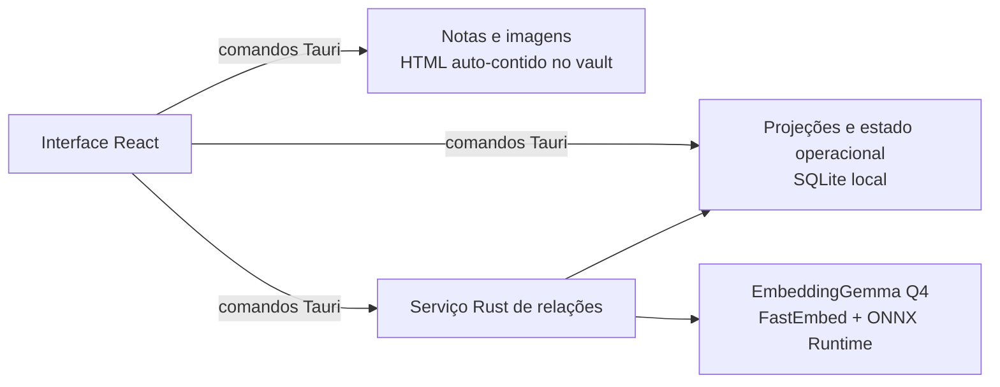

# Hyperzettel

Aplicativo desktop para Windows voltado a quem organiza conhecimento pelo método Zettelkasten, com notas, conexões, revisão espaçada e relações semânticas processadas no próprio computador.

## Por que existe

Capturar notas é fácil; transformar capturas em ideias reutilizáveis e conectadas exige um fluxo explícito. O Hyperzettel reúne captura, processamento, escrita, conexões justificadas e revisão em um único espaço. Notas, imagens, embeddings e histórico permanecem no dispositivo.

## Quickstart

Em um Windows com os [pré-requisitos](#instalação-e-pré-requisitos) instalados:

```powershell
git clone https://github.com/rafaelkenedy/hyperzettel.git
cd hyperzettel
git lfs install
git lfs pull
npm ci
npm run tauri dev
```

O último comando inicia o frontend Vite e abre a janela nativa do Tauri. A primeira compilação baixa as dependências Rust e o binário de build do ONNX Runtime.

## Exemplo de uso real

1. Crie uma nota, escreva uma ideia e pressione `Ctrl+S` para concluí-la.
2. Crie outra nota e conecte-a à primeira, registrando o motivo da conexão.
3. Abra **Mapa** para explorar as duas notas. Quando uma revisão vencer, use **A revisar** para registrar como foi a lembrança.

As ações produzem mensagens observáveis na interface:

```text
Nota concluída e disponível para revisão.
Conexão criada. Explique por que as notas se conectam.
```

O menu da janela também exporta um arquivo `hyperzettel-notas-AAAA-MM-DD.json` com notas, imagens e histórico de aprendizagem.

## Instalação e pré-requisitos

### Para usar o aplicativo

As versões publicadas ficam na página de [Releases](https://github.com/rafaelkenedy/hyperzettel/releases). Para usar o aplicativo, baixe o instalador Windows x64. O NSIS já contém o modelo EmbeddingGemma e seus arquivos de tokenizer; a instalação e a primeira execução não fazem um download separado do modelo.

O instalador ainda não possui assinatura de código. O Windows pode exibir um aviso do SmartScreen.

### Para desenvolver

- Windows x64;
- Git com Git LFS;
- Node.js `^20.19.0` ou `>=22.12.0` e npm;
- Rust `1.77.2` ou mais recente, com o target `x86_64-pc-windows-msvc`;
- Microsoft C++ Build Tools com Windows SDK;
- Microsoft Edge WebView2 Runtime.

O projeto não depende de servidor, banco externo ou chave de API.

## Configuração

O runtime da aplicação não lê variáveis de ambiente. As variáveis encontradas no repositório pertencem às ferramentas de desenvolvimento:

| Variável | Padrão | Descrição |
| --- | --- | --- |
| `GITHUB_TOKEN` | gerado pelo GitHub Actions | Autoriza o workflow a criar a Release e enviar o instalador. |
| `HYPERZETTEL_BENCHMARK_BATCH` | não definida | Comunicação interna entre os processos do benchmark opt-in; não é usada na execução normal. |
| `HYPERZETTEL_RETRIEVAL_FIXTURE` | `src/seed/cs50-notes.json` | Caminho opcional para um backup JSON ou vault HTML usado somente pelo benchmark de recuperação. |

## Como funciona



Cada nota combina três dimensões distintas:

- **pasta:** Entrada, Projetos, Áreas, Recursos, Diário, Incubadora ou Arquivo;
- **estágio:** Fugaz, Fonte, Permanente, Estrutura ou Referência;
- **modelo:** uma das dez estruturas de conteúdo, como conceito, projeto, reunião ou diário.

O editor persiste conteúdo significativo 700 ms após a última alteração. O autosave protege o arquivo sem decidir a maturidade da ideia: ela continua como rascunho até o usuário escolher **Concluir nota** ou pressionar `Ctrl+S`. Conexões manuais guardam o identificador da outra nota e um motivo textual opcional.

Cada nota criada pelo aplicativo recebe um arquivo legível como
`20260726-194530--relacoes-semanticas--a1b2c3d4.html`: timestamp UTC de criação,
título normalizado e oito caracteres do ID interno. O nome permanece estável
depois do primeiro salvamento, pode ser alterado externamente e não define a
identidade da nota; essa identidade continua no metadado `hz:id` do HTML.
Arquivos criados manualmente podem usar qualquer nome simples terminado em
`.html` (inclusive `.HTML`). Na inicialização, o aplicativo compara nome e
SHA-256 com o índice: edições, renomes, inclusões e remoções externas provocam
reindexação. Arquivos sem `hz:id` ou com um ID duplicado são informados e não
entram no índice até serem corrigidos. Na Central do Vault, arquivos sem
identidade podem ser adotados e grupos duplicados podem ser separados sem
excluir conteúdo: um arquivo conserva o ID original e as demais cópias recebem
novas identidades.

Na aplicação Tauri, o frontend sincroniza as notas salvas com um serviço Rust. O serviço valida e carrega o EmbeddingGemma Q4 empacotado, gera embeddings localmente e grava o resultado em `hyperzettel.sqlite`. A configuração atual considera similaridade mínima de `0,68` e mantém até cinco relações automáticas por nota. A interface permite rejeitar, restaurar, pausar, continuar ou tentar novamente essa análise.

O mapa de conhecimento combina conexões, estimativa de retenção e uma fila de revisão. A fila contém apenas notas vencidas e funciona como uma sessão finita: abre a primeira, avança após cada avaliação e mostra o progresso até a conclusão. Cada nota pode definir uma pergunta de recuperação própria; sem ela, o título vira a pista. A resposta e os graus de lembrança aparecem somente depois da revelação. O agendamento usa SM-2 para recalcular o próximo intervalo. A exportação JSON reúne notas, imagens e esse histórico de aprendizagem.

Os arquivos do modelo e seus hashes estão em `src-tauri/resources/models/embeddinggemma-300m-q4`. Os termos do EmbeddingGemma e o notice distribuído com o aplicativo estão em `src-tauri/resources/licenses`.

## Desenvolvimento

Interface web, sem SQLite nem relações semânticas nativas:

```powershell
npm run dev
```

Aplicação desktop:

```powershell
npm run tauri dev
```

Verificações do frontend:

```powershell
npm run lint
npm run typecheck
npm test
npm run build
```

Verificações do backend:

```powershell
cd src-tauri
cargo fmt --all -- --check
cargo clippy --all-targets --all-features -- -D warnings
cargo test
cd ..
```

Build local do instalador NSIS:

```powershell
npm run tauri -- build --bundles nsis
```

O instalador é gravado em `src-tauri/target/release/bundle/nsis/`. Pushes e pull requests para `main` executam o workflow de CI. Uma tag `v*` executa os testes, baixa o Git LFS, compila o instalador em um runner Windows e publica uma GitHub Release.

Organização principal:

```text
src/
  app/             composição, navegação e estado da interface
  application/     importação e exportação de backup
  domain/          regras de notas, conexões e modelos
  features/        dashboard, notas, processamento e conhecimento
  infrastructure/  fronteira IPC do vault e índice derivado
  shared/          utilitários sem dependência de feature
src-tauri/
  src/             comandos, SQLite e relações semânticas
  resources/       modelo local e termos de distribuição
  tests/           benchmark opt-in do modelo
```

Detalhes de preparação, release e Git LFS estão em
[docs/development.md](docs/development.md). A decisão de persistência está no
[ADR 0006](docs/adr/0006-html-per-note-persistence.md), com seu
[modelo de ameaças](docs/security/vault-threat-model.md). A arquitetura do
pipeline semântico está em
[docs/relations-native.md](docs/relations-native.md).

## Troubleshooting

### A build informa que o modelo está ausente ou falhou na validação

Materialize os arquivos rastreados pelo Git LFS e tente novamente:

```powershell
git lfs install
git lfs pull
git lfs fsck
```

O arquivo `model_no_gather_q4.onnx_data` tem aproximadamente 186 MiB. Um ponteiro LFS não materializado falha na validação por design.

### As relações automáticas não aparecem com `npm run dev`

O modo web não possui o backend Rust. Execute a aplicação nativa:

```powershell
npm run tauri dev
```

### A primeira compilação falha sem acesso à rede

O modelo está no repositório, mas npm e Cargo ainda precisam baixar dependências; o recurso `ort-download-binaries-rustls-tls` também obtém o binário de build do ONNX Runtime. Prepare o clone com acesso à rede antes de trabalhar offline.
