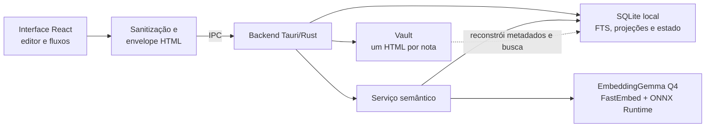

# Hyperzettel

Aplicativo desktop para Windows voltado a quem organiza conhecimento pelo método Zettelkasten, com notas, conexões, revisão espaçada e relações semânticas processadas no próprio computador.

## Por que existe

Capturar notas é fácil; transformar capturas em ideias reutilizáveis e conectadas exige um fluxo explícito. O Hyperzettel reúne captura, processamento, escrita, conexões justificadas e revisão em um único espaço. Notas, imagens, embeddings e histórico permanecem no dispositivo.

## Quickstart

Em um Windows com os [pré-requisitos](#instalação-e-pré-requisitos) instalados:

```powershell
git clone https://github.com/rafaelkenedy/hyperzettel.git
cd hyperzettel
git lfs install
git lfs pull
npm ci
npm run tauri dev
```

O último comando inicia o frontend Vite e abre a janela nativa do Tauri. A primeira compilação baixa as dependências Rust e o binário de build do ONNX Runtime.

## Exemplo de uso real

1. Crie uma nota, escreva uma ideia e pressione `Ctrl+S` para concluí-la.
2. Crie outra nota e conecte-a à primeira, registrando o motivo da conexão.
3. Abra **Mapa** para explorar as duas notas. Quando uma revisão vencer, use **A revisar** para registrar como foi a lembrança.

As ações produzem mensagens observáveis na interface:

```text
Nota concluída e disponível para revisão.
Conexão criada. Explique por que as notas se conectam.
```

O menu da janela também exporta um arquivo
`hyperzettel-notas-AAAA-MM-DD.json` com notas, imagens, histórico de
aprendizagem e decisões de rejeitar sugestões semânticas. A Central do Vault
recomenda a primeira exportação e renova o lembrete a cada sete dias.

## Instalação e pré-requisitos

### Para usar o aplicativo

As versões publicadas ficam na página de [Releases](https://github.com/rafaelkenedy/hyperzettel/releases). Para usar o aplicativo, baixe o instalador Windows x64. O NSIS já contém o modelo EmbeddingGemma e seus arquivos de tokenizer; a instalação e a primeira execução não fazem um download separado do modelo.

O instalador ainda não possui assinatura de código. O Windows pode exibir um aviso do SmartScreen.

### Para desenvolver

- Windows x64;
- Git com Git LFS;
- Node.js `^20.19.0` ou `>=22.12.0` e npm;
- Rust `1.77.2` ou mais recente, com o target `x86_64-pc-windows-msvc`;
- Microsoft C++ Build Tools com Windows SDK;
- Microsoft Edge WebView2 Runtime.

O projeto não depende de servidor, banco externo ou chave de API.

## Configuração

O runtime da aplicação não lê variáveis de ambiente. As variáveis encontradas no repositório pertencem às ferramentas de desenvolvimento:

| Variável | Padrão | Descrição |
| --- | --- | --- |
| `GITHUB_TOKEN` | gerado pelo GitHub Actions | Autoriza o workflow a criar a Release e enviar o instalador. |
| `HYPERZETTEL_BENCHMARK_BATCH` | não definida | Comunicação interna entre os processos do benchmark opt-in; não é usada na execução normal. |
| `HYPERZETTEL_RETRIEVAL_FIXTURE` | `src/seed/cs50-notes.json` | Caminho opcional para um backup JSON ou vault HTML usado somente pelo benchmark de recuperação. |

## Como funciona

### Arquitetura local-first



O armazenamento está dividido por responsabilidade:

| Componente | O que contém | Como é recuperado |
| --- | --- | --- |
| Vault de arquivos HTML | Conteúdo, imagens inline, metadados e conexões manuais de saída | É a fonte da verdade das notas; pode ser aberto, copiado ou versionado sem o aplicativo. |
| SQLite — projeções | Nome físico, SHA-256, metadados, texto puro e índice FTS5 | É reconstruído a partir do vault quando nomes ou hashes divergem. |
| SQLite — estado do usuário | Histórico de retenção e decisões de rejeitar relações semânticas | Não é derivável dos HTMLs; depende do backup JSON verificado. |
| SQLite — relações semânticas | Embeddings, fila e relações automáticas | Pode ser recalculado localmente com o modelo empacotado. |

Não há servidor de aplicação: leitura, busca, revisão e inferência acontecem no
dispositivo. O frontend prepara e sanitiza os documentos; o backend Rust
controla caminhos, gravações atômicas, índice SQLite e processamento semântico.

### Fluxo do produto e interface

Cada nota combina três dimensões distintas:

- **pasta:** Entrada, Projetos, Áreas, Recursos, Diário, Incubadora ou Arquivo;
- **estágio:** Fugaz, Fonte, Permanente, Estrutura ou Referência;
- **modelo:** uma das onze estruturas de conteúdo, como conceito, estudo, projeto, reunião ou diário.

Num vault vazio, o início pede um assunto real e cria uma nota de estrutura para
guiar o primeiro ciclo. A navegação revela processamento, pastas, mapa e revisão
à medida que o próprio conteúdo torna cada área útil. O objetivo inicial é
produzir três ideias permanentes conectadas, não preencher um tutorial separado.

O espaço de notas usa navegação, coleção, editor e propriedades. Em janelas
largas, os três painéis de trabalho são redimensionáveis e podem ser recolhidos;
em larguras menores, coleção e propriedades viram painéis auxiliares para
preservar a área de escrita.

O editor persiste conteúdo significativo 700 ms após a última alteração. O autosave protege o arquivo sem decidir a maturidade da ideia: ela continua como rascunho até o usuário escolher **Concluir nota** ou pressionar `Ctrl+S`. Conexões manuais guardam o identificador da outra nota e um motivo textual opcional.

### Editor e documento portátil

Além de títulos, listas, citações, links e imagens, o editor aceita tabelas,
linha divisória, destaque com `<mark>` e blocos de código. Blocos preservam
quebras de linha, permitem escolher entre 17 linguagens e recebem coloração de
sintaxe local; a apresentação também é gravada no HTML para continuar legível
fora do aplicativo.

O corpo passa por uma allowlist antes de ser salvo. Imagens raster são
otimizadas e embutidas como data URI, sem arquivos auxiliares. O documento é
formatado com um bloco por linha para produzir diffs menores, e só inclui o CSS
standalone necessário aos recursos usados naquela nota.

Cada nota criada pelo aplicativo recebe um arquivo legível como
`20260726-194530--relacoes-semanticas--a1b2c3d4.html`: timestamp UTC de criação,
título normalizado e oito caracteres do ID interno. O nome permanece estável
depois do primeiro salvamento, pode ser alterado externamente e não define a
identidade da nota; essa identidade continua no metadado `hz:id` do HTML.

Ao abrir uma nota diretamente no navegador, a seção **Conexões** apresenta
relações mútuas, notas citadas e backlinks. Cada item usa o título e o nome
físico real como link, mantém o ID como fallback e mostra os motivos registrados
nas duas pontas. Essa seção é derivada e fica fora do corpo editável; os
metadados `hz:connection` continuam sendo a fonte canônica apenas das conexões
de saída. Como um backlink muda quando outra nota é editada, a Central do Vault
oferece **Atualizar conexões** para reescrever somente projeções desatualizadas,
pulando arquivos que estejam em conflito.

### Vault, identidade e recuperação

Arquivos criados manualmente podem usar qualquer nome simples terminado em
`.html` (inclusive `.HTML`). Gravações usam arquivo temporário e publicação
atômica; o backend restringe todas as operações ao diretório do vault. Cada
documento é limitado a 25 MiB para que um arquivo externo não bloqueie a abertura
do conjunto.

Na inicialização e ao retomar a janela, o aplicativo compara nome e SHA-256 com
o índice. Edições, renomes, inclusões e remoções externas provocam reconciliação;
uma divergência concorrente nunca é sobrescrita silenciosamente. Se houver um
rascunho local, ele pode ser preservado com uma identidade nova antes de aceitar
o estado externo.

Arquivos sem `hz:id`, acima do limite ou com identidade duplicada ficam
isolados do índice, mas permanecem intactos no disco. Na Central do Vault é
possível inspecionar o conjunto, abrir a pasta, reconstruir o índice, adotar um
HTML sem identidade e separar duplicatas: um arquivo conserva o ID original e
as demais cópias recebem novas identidades.

### Busca, relações e revisão

A listagem e a busca textual usam as projeções e o FTS5 do SQLite, sem reler
todos os HTMLs a cada consulta. O frontend sincroniza notas persistidas com o
serviço Rust, que valida e carrega o EmbeddingGemma Q4 empacotado, gera
embeddings localmente e mantém até cinco relações automáticas por nota a partir
da similaridade mínima atual de `0,68`. Relações automáticas podem ser rejeitadas,
restauradas, pausadas ou recalculadas; elas não alteram as conexões manuais.

O mapa de conhecimento combina conexões, estimativa de retenção e uma fila de
revisão. A média e a curva consideram somente notas concluídas e revisáveis;
capturas e rascunhos permanecem visíveis no grafo.

A fila contém apenas notas vencidas e funciona como uma sessão finita: abre a
primeira, avança após cada avaliação e mostra o progresso até a conclusão. O
atalho de uma nota abre uma prática avulsa somente para ela, mesmo antes do
vencimento, sem adicioná-la à fila automática. Cada nota pode definir uma
pergunta de recuperação própria; sem ela, o título vira a pista. A resposta e
os graus de lembrança aparecem somente depois da revelação. O agendamento usa
SM-2 para recalcular o próximo intervalo.

O modelo **Nota de estudo** transforma uma única ideia de aula, leitura ou questão
em uma explicação com palavras próprias, exemplo, limite e fonte. Ele já nasce
como nota permanente e orienta o título como pergunta de recuperação, entrando
no mesmo ciclo de revisão após ser concluído.

### Backup

O backup JSON v3 reúne as notas — com imagens já embutidas —, o histórico de
aprendizagem e as decisões de rejeitar relações semânticas. Formatos v1 e v2
continuam importáveis. Na exportação nativa, o backend grava em um arquivo
temporário, sincroniza, publica e relê o destino para conferir tamanho e
SHA-256.

O lembrete de backup só é renovado depois que o aplicativo salva, reabre e
verifica o arquivo JSON escolhido pelo usuário. O conteúdo não é enviado para a
rede.

Os arquivos do modelo e seus hashes estão em `src-tauri/resources/models/embeddinggemma-300m-q4`. Os termos do EmbeddingGemma e o notice distribuído com o aplicativo estão em `src-tauri/resources/licenses`.

## Desenvolvimento

Interface web, sem SQLite nem relações semânticas nativas:

```powershell
npm run dev
```

Aplicação desktop:

```powershell
npm run tauri dev
```

Verificações do frontend:

```powershell
npm run lint
npm run typecheck
npm test
npm run build
```

Verificações do backend:

```powershell
cd src-tauri
cargo fmt --all -- --check
cargo clippy --all-targets --all-features -- -D warnings
cargo test
cd ..
```

Build local do instalador NSIS:

```powershell
npm run tauri -- build --bundles nsis
```

O instalador é gravado em `src-tauri/target/release/bundle/nsis/`. Pushes e pull requests para `main` executam o workflow de CI. Uma tag `v*` executa os testes, baixa o Git LFS, compila o instalador em um runner Windows e publica uma GitHub Release.

Organização principal:

```text
src/
  app/             shell responsivo, providers, navegação e estado da sessão
  application/     casos de uso de importação, exportação e lembrete de backup
  domain/          regras de notas, conexões, estágios e modelos
  features/        dashboard, notas, processamento, onboarding, mapa e vault
  infrastructure/  fronteiras IPC do vault, backup, índice e imagens
  shared/          envelope HTML, sanitizer e utilitários transversais
src-tauri/
  src/
    commands/      comandos IPC de notas, vault, backup e relações
    vault/         acesso restrito e gravação atômica dos arquivos HTML
    note_index/    projeções de notas e busca FTS5 no SQLite
    knowledge/     embeddings, fila e relações semânticas
    database/      conexão e migrações do estado operacional
  resources/       modelo local e termos de distribuição
  tests/           benchmark opt-in do modelo
```

Detalhes de preparação, release e Git LFS estão em
[docs/development.md](docs/development.md). A decisão de persistência está no
[ADR 0006](docs/adr/0006-html-per-note-persistence.md), com seu
[modelo de ameaças](docs/security/vault-threat-model.md). A arquitetura do
pipeline semântico está em
[docs/relations-native.md](docs/relations-native.md), e o protocolo do benchmark
de recuperação está em
[docs/benchmarks/retrieval-baseline.md](docs/benchmarks/retrieval-baseline.md).

## Troubleshooting

### A build informa que o modelo está ausente ou falhou na validação

Materialize os arquivos rastreados pelo Git LFS e tente novamente:

```powershell
git lfs install
git lfs pull
git lfs fsck
```

O arquivo `model_no_gather_q4.onnx_data` tem aproximadamente 186 MiB. Um ponteiro LFS não materializado falha na validação por design.

### As relações automáticas não aparecem com `npm run dev`

O modo web não possui o backend Rust. Execute a aplicação nativa:

```powershell
npm run tauri dev
```

### A primeira compilação falha sem acesso à rede

O modelo está no repositório, mas npm e Cargo ainda precisam baixar dependências; o recurso `ort-download-binaries-rustls-tls` também obtém o binário de build do ONNX Runtime. Prepare o clone com acesso à rede antes de trabalhar offline.
