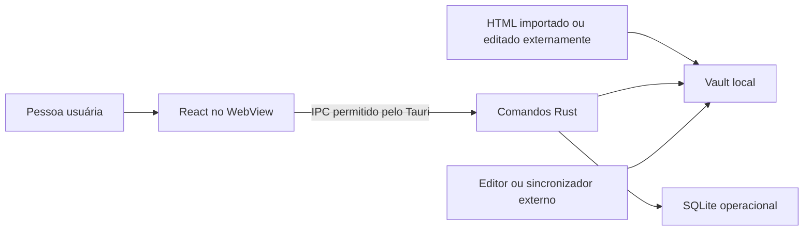

# Modelo de ameaças do vault local

- **Versão:** 1
- **Revisado em:** 2026-07-26
- **Decisão relacionada:** [ADR 0006](../adr/0006-html-per-note-persistence.md)

## Objetivo e escopo

Este documento cobre a fronteira entre a interface React no WebView, os comandos
Tauri em Rust, o vault de HTMLs e o `hyperzettel.sqlite`. Também considera
editores, ferramentas de sincronização e outros processos locais capazes de
alterar arquivos enquanto o aplicativo está aberto.

Estão fora do escopo: comprometimento do sistema operacional ou de uma conta
administradora, segurança interna de um provedor de sincronização, colaboração
multiusuário concorrente e confidencialidade de backups guardados fora do
dispositivo.

## Ativos

- conteúdo textual e imagens inline das notas;
- identidade `hz:id`, timestamps e conexões justificadas;
- associação entre ID, nome físico e hash;
- histórico e agenda de revisão;
- embeddings, sugestões e decisões de rejeição;
- disponibilidade e recuperabilidade da coleção.

## Fronteiras de confiança

O conteúdo HTML, o nome de arquivo e qualquer estado recebido pelo IPC devem ser
tratados como entrada não confiável. O SQLite e o vault ficam sob a mesma conta
do sistema operacional; eles não formam uma barreira contra outro processo com
os mesmos privilégios.

## Análise STRIDE

| Classe | Cenário | Controles existentes | Risco residual |
| --- | --- | --- | --- |
| **Spoofing** | Um HTML forja o `hz:id` de outra nota ou duas cópias usam o mesmo ID. | Parse da identidade interna; duplicatas ficam fora do índice; resolução explícita escolhe a cópia que conserva o ID; comandos conferem ID solicitado contra o HTML. | Um processo local pode continuar modificando os arquivos; não há assinatura criptográfica de autoria. |
| **Tampering** | Um editor altera, renomeia ou remove a nota entre a leitura e uma mutação. | SHA-256 no índice; comparação antes de ler/salvar/excluir; adoção e reparo usam compare-and-set por hash; conflito não sobrescreve conteúdo; gravação temporária seguida de `rename`. | Existe uma janela TOCTOU porque o filesystem não oferece compare-and-set atômico por conteúdo. Falha de energia após `rename` não tem garantia forte sem `fsync` do diretório pai. |
| **Repudiation** | Não é possível saber quem editou ou excluiu um arquivo. | Mensagens de operação e timestamps ajudam no diagnóstico local. | Não há log de auditoria nem atribuição. É uma decisão compatível com um app pessoal local, não com uso multiusuário regulado. |
| **Information disclosure** | HTML malicioso tenta carregar dados ou escapar do vault; outra pessoa lê os arquivos. | Sanitização na importação/serialização; CSP restringe scripts, conexões e origens; nomes aceitos são apenas `.html` simples; caminhos, links simbólicos e tipos não regulares são rejeitados; runtime não requer nuvem. | Vault e backups são texto claro. Quem obtiver acesso à conta, ao disco ou à pasta de backup pode ler notas e imagens. `data:` e `blob:` são permitidos para imagens. |
| **Denial of service** | HTML ou imagem base64 muito grande consome memória; duplicatas ou SQLite corrompido impedem a carga. | Importação de backup limitada a 120 MB; cada HTML é limitado a 25 MiB antes do IPC e da leitura; arquivos externos maiores são isolados sem serem carregados; hashes normais são calculados em streaming; conflitos são isolados; projeções e embeddings podem ser reconstruídos; operações de escrita no processo são serializadas. | O parse de cada arquivo aceito ainda não é incremental e uma coleção hostil com muitos documentos dentro do teto pode causar alta CPU; estado de revisão depende de backup se o SQLite for perdido. |
| **Elevation of privilege** | Conteúdo do WebView tenta usar IPC para operar fora do vault ou executar código. | O backend possui a raiz; comandos recebem nomes, não caminhos arbitrários; validação de extensão e travessia; CSP usa scripts apenas de `'self'`. A abertura da pasta chama `explorer.exe` somente com a raiz mantida pelo backend. | Uma futura vulnerabilidade de script no WebView teria acesso aos comandos Tauri permitidos e, portanto, ao vault inteiro. Não há autorização por nota. |

## Controles por camada

### WebView e importação

- O conteúdo de notas é sanitizado antes de entrar no editor ou ser
  serializado.
- A CSP permite scripts apenas do bundle local e restringe `connect-src` ao
  próprio app e ao IPC.
- O backup rejeita formato desconhecido, entradas sem coleção válida e arquivos
  maiores que 120 MB. Rejeições semânticas têm limite de quantidade e validação
  de IDs, hashes, pipeline e timestamp antes da gravação transacional do lote.
- Cada documento HTML tem teto de 25 MiB. A interface rejeita uma nota gerada
  acima do limite antes do IPC; o backend repete a validação como autoridade.
- Com notas no vault, a interface recomenda o primeiro backup e renova o
  lembrete após sete dias. Apenas o timestamp da exportação iniciada fica no
  `localStorage`; o conteúdo não é duplicado ali.

### IPC e identidade

- Os comandos não inferem identidade a partir do nome do arquivo.
- Leitura, salvamento, exclusão e adoção validam a relação entre ID, HTML e
  hash.
- Erros de índice não autorizam uma segunda escrita ou exclusão destrutiva; a
  recuperação primeiro observa o estado físico.

### Filesystem

- O vault é uma raiz controlada pelo backend e não é percorrido recursivamente.
- Somente arquivos regulares `.html` entram na listagem.
- Separadores, `..`, links simbólicos e tipos especiais são rejeitados.
- Um HTML externo acima de 25 MiB é listado como conflito recuperável, sem ser
  transferido ou parseado. Seu fingerprint usa tamanho, evitando lê-lo inteiro.
- Leitura usa `limite + 1` bytes no máximo e hashing usa streaming.
- Escritas do processo usam nome temporário único, `sync_all` do arquivo e
  publicação por `rename`.

### SQLite e recuperação

- Atualizações da projeção de uma nota usam transação.
- Divergência de nome ou hash provoca reconciliação.
- Metadados, FTS, embeddings e relações automáticas podem ser refeitos.
- O backup v3 inclui histórico de revisão e rejeições semânticas, que não são
  derivados dos HTMLs; versões anteriores permanecem compatíveis sem esse
  segundo conjunto.

## Cenários obrigatórios de teste

- nota criada, lida, renomeada externamente, reconciliada e excluída por ID;
- edição externa bloqueia leitura destrutiva, salvamento e exclusão;
- arquivo sem `hz:id` é adotado somente se o hash ainda corresponde;
- duplicatas são isoladas e separadas sem apagar conteúdo;
- nome com travessia, extensão inválida ou link simbólico é rejeitado;
- documento acima de 25 MiB é rejeitado no salvamento e isolado na inspeção;
- falha do índice após gravar não repete a mutação física;
- vault vazio e índice ausente iniciam sem falso erro de perda.

Esses cenários devem permanecer cobertos por testes unitários ou de integração
sempre que a fronteira de persistência mudar.

## Riscos priorizados e próximos controles

| Prioridade | Risco | Próximo controle recomendado |
| --- | --- | --- |
| Média | Download iniciado não garante que o arquivo permaneceu em local seguro | Considerar destino nativo configurável ou verificação explícita do arquivo numa evolução futura. |
| Média | Mudança externa não percebida durante sessão longa | Observar o diretório ou oferecer ação clara de recarregar/reconciliar. |
| Média | Corrida TOCTOU com outro processo local | Revalidar hash o mais próximo possível da publicação e documentar o limite de concorrência. |
| Baixa | Falta de trilha forense | Só adicionar log local se surgir caso multiusuário ou requisito regulatório. |

## Critério para revisão

Revisar este modelo ao adicionar sincronização, escolha de vault externo,
plugins, abertura de links/recursos remotos, novos comandos Tauri, criptografia
ou colaboração entre dispositivos.
